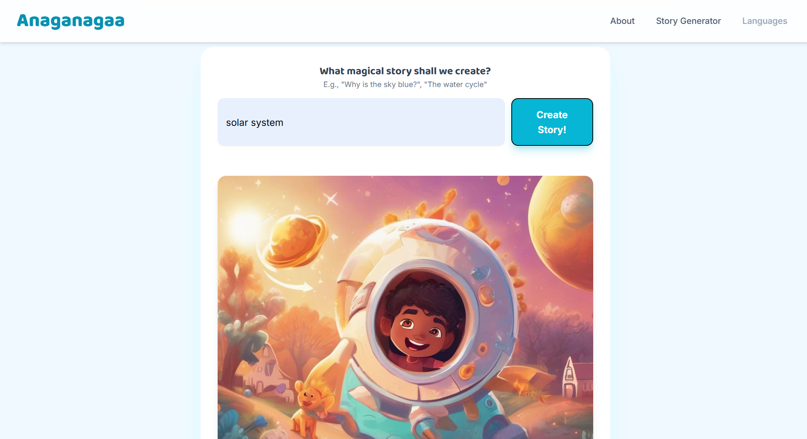
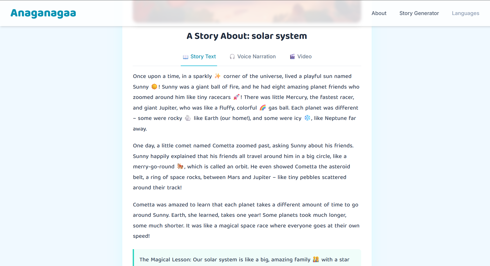

# Anaganagaa - AI Storytelling for Education ✨

A full-stack web application that uses Generative AI to turn any educational topic into a magical, illustrated story for children.

[](https://anaganaga-app.netlify.app/)

 
 
*(To add a screenshot: Take a picture of your running app, name it `anaganagaa-screenshot.png`, and place it in the main project folder.)*

---

## 🚀 About The Project

"Anaganagaa" (meaning "Once upon a time..." in Telugu) was born from the idea that learning should be an adventure, not a chore. Many complex topics in science and math can be intimidating for young learners. This application is our mission to solve that problem. 

We use the power of Large Language Models (LLMs) and Image Generation models to transform any topic—from photosynthesis to black holes—into a simple, fun, and visually engaging story. By making learning magical, we hope to spark a lifelong love of discovery and knowledge in every child.

---

## 📚 Features

*   **AI Story Generation:** Enter any topic and receive a unique, educational story.
*   **AI Image Generation:** Each story is accompanied by a beautiful, AI-generated illustration.
*   **Text-to-Speech:** Listen to the story with a clear voice narration.
*   **Real-time Word Highlighting:** Follow along as each spoken word is highlighted in the text.
*   **Secure Backend:** A Node.js server securely handles all API requests, keeping secret keys safe.
*   **Fully Deployed:** Live and accessible to anyone in the world!

---

## 🛠️ Tech Stack

This project was built using a modern full-stack approach:

*   **Frontend:**
    *   HTML5
    *   Tailwind CSS
    *   Vanilla JavaScript

*   **Backend:**
    *   Node.js
    *   Express.js
    *   Axios (for API requests)

*   **Generative AI APIs:**
    *   **Google Gemini Pro:** For generating the story text.
    *   **Hugging Face (Stable Diffusion):** For free, high-quality image generation.

*   **Deployment:**
    *   **Render:** For hosting the backend Node.js server.
    *   **Netlify:** For hosting the static frontend site.

---

## ⚙️ Getting Started (Local Setup)

To get a local copy up and running, follow these simple steps.

### Prerequisites

*   **Node.js** and **npm** installed on your machine.
*   **Git** for version control.

### Installation

1.  **Clone the repository:**
    ```sh
    git clone https://github.com/rakeshk246/Anaganaga-app.git
    ```
2.  **Navigate to the project directory:**
    ```sh
    cd Anaganaga-app
    ```
3.  **Set up the Backend:**
    *   Navigate to the backend folder:
        ```sh
        cd backend
        ```
    *   Install the required NPM packages:
        ```sh
        npm install
        ```
    *   Create a `.env` file in the `backend` folder and add your API keys:
        ```
        GEMINI_API_KEY="YOUR_GEMINI_API_KEY_HERE"
        HUGGING_FACE_API_TOKEN="YOUR_HUGGING_FACE_TOKEN_HERE"
        ```
    *   Start the backend server:
        ```sh
        node server.js
        ```
        Your server should now be running on `http://localhost:3000`.

4.  **Launch the Frontend:**
    *   Open a new terminal or navigate out of the backend folder.
    *   Open the `frontend/index.html` file directly in your web browser. The application should now be fully functional on your local machine.

---

## 🤝 Contact

Rakesh K - [@rakeshk246](https://github.com/rakeshk246)

Project Link: [https://github.com/rakeshk246/Anaganaga-app](https://github.com/rakeshk246/Anaganaga-app)